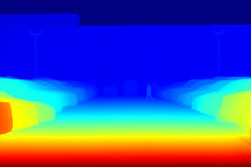

# Depth-Estimation-Monocular-Camera

## Real-time Depth Estimation with Depth Anything V2

This repository hosts an implementation of the Depth Anything V2 model, which uses vision transformers to estimate depth from images. The application captures real-time video feed, processes it through the model, and visualizes depth maps.

## Project Overview

This project demonstrates how to apply the Depth Anything V2 model for real-time depth estimation. Below are example transformations from the model:

| Original Image | Depth Map |
|:--------------:|:---------:|
|  |  |

